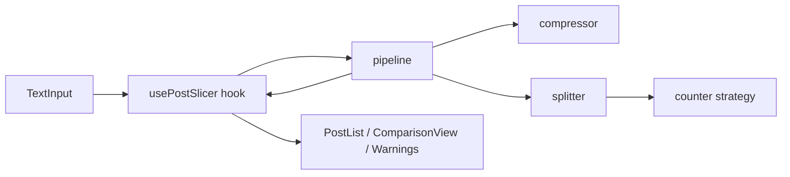

# Architecture

```mermaid
flowchart LR
  A[TextInput] --> B[usePostSlicer hook]
  B --> C[pipeline]
  C --> D[compressor]
  C --> E[splitter]
  E --> F[counter strategy]
  C --> B
  B --> G[PostList / ComparisonView / Warnings]
```

Rule: components -> hook -> pipeline -> core. Core never imports from React or the UI.
